# IAM 业务流程文档

## 一、项目概述

### 1.1 系统定位

IAM（Identity and Access Management）是 GoArk 平台的身份认证与访问管理服务，为多租户 SaaS 系统提供用户身份认证、权限管理、单点登录（SSO）能力。

### 1.2 核心概念

| 概念 | 说明 | 业务特点 |
|------|------|----------|
| **Organization** | 组织 | 顶层实体，代表企业/机构，通过域名（Domain）区分 |
| **Tenant** | 租户 | 属于组织，可支持多租户场景，含租户路径（tenant_path）支持层级 |
| **Person** | 自然人 | 平台级用户实体，存储身份信息（手机、邮箱、密码哈希），一个自然人可关联多个租户的用户账号 |
| **User** | 用户账号 | 租户级实体，代表某自然人在某租户下的登录账号 |
| **Department** | 部门 | 属于租户，支持树形层级（parent_id + dept_path） |
| **Role** | 角色 | 属于租户，支持数据权限范围（all/dept_and_sub/dept/self/custom） |
| **Menu** | 菜单 | 属于租户，支持访问策略控制（public/authorized/org_admin/tenant_admin） |
| **Application** | 应用 | OIDC 客户端应用配置，用于第三方应用 SSO |

### 1.3 模块架构图

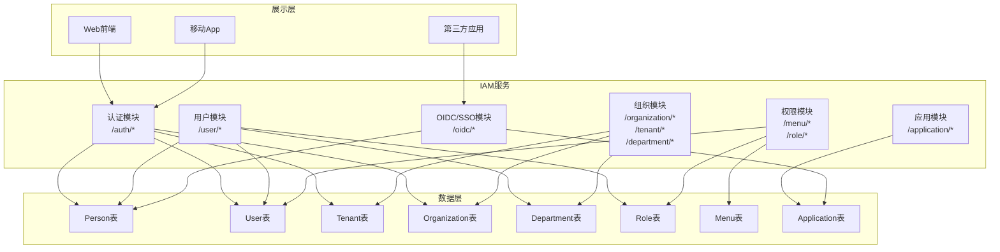

---

## 二、数据模型关系

### 2.1 Entity 关系图

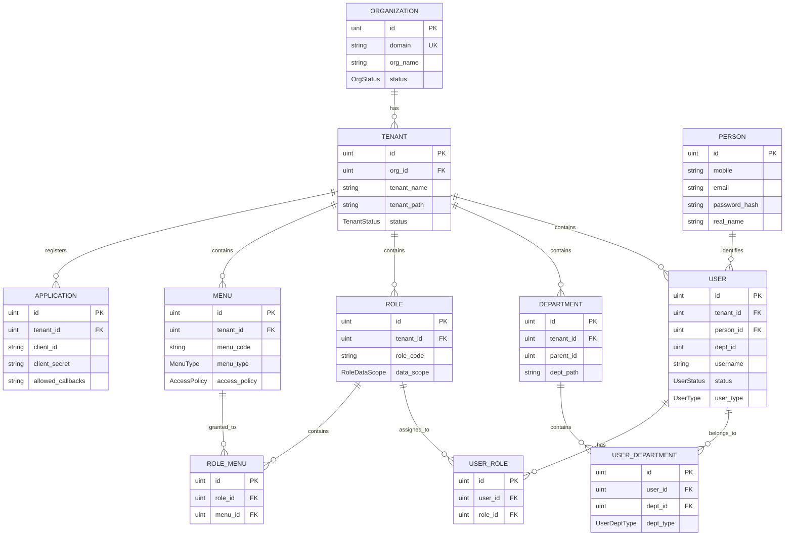

### 2.2 核心表字段说明

#### Person（自然人表）
| 字段 | 类型 | 说明 |
|------|------|------|
| id | bigint | 主键 |
| mobile | varchar(16) | 手机号（登录账号） |
| email | varchar(64) | 邮箱（登录账号） |
| password_hash | varchar(128) | 密码哈希 |
| real_name | varchar(32) | 真实姓名 |
| avatar_url | varchar(255) | 头像URL |

#### User（用户账号表）
| 字段 | 类型 | 说明 |
|------|------|------|
| id | bigint | 主键 |
| tenant_id | bigint | 所属租户ID |
| person_id | bigint | 关联自然人ID |
| dept_id | bigint | 主部门ID（冗余） |
| username | varchar(32) | 用户名（租户内唯一） |
| status | varchar(16) | enabled/locked/disabled |
| user_type | varchar(16) | normal/tenant_admin/platform_admin |
| login_fail_count | int | 连续登录失败次数 |
| locked_until | datetime | 账户锁定截止时间 |

#### Tenant（租户表）
| 字段 | 类型 | 说明 |
|------|------|------|
| id | bigint | 主键 |
| org_id | bigint | 所属组织ID |
| tenant_name | varchar(128) | 租户名称 |
| tenant_code | varchar(32) | 租户编码 |
| tenant_path | varchar(512) | 租户路径（如 /1/2/3/） |
| status | varchar(16) | enabled/trial/expired/disabled |

#### Department（部门表）
| 字段 | 类型 | 说明 |
|------|------|------|
| id | bigint | 主键 |
| tenant_id | bigint | 所属租户ID |
| parent_id | bigint | 父部门ID（0表示根部门） |
| dept_path | varchar(512) | 部门路径（如 /1/2/3/） |
| dept_level | int | 部门层级 |

---

## 三、认证授权模块

### 3.1 业务概念

#### 3.1.1 登录方式
| 方式 | 说明 |
|------|------|
| **密码登录** | 用户名（手机/邮箱）+ 密码登录，需先选择租户 |
| **OIDC/SSO** | 第三方应用通过 OAuth2/OIDC 授权码模式接入 |

#### 3.1.2 Token 类型
| 类型 | 过期时间 | 说明 |
|------|----------|------|
| **TempToken** | 10分钟 | 临时令牌，登录后选择租户前使用 |
| **AuthToken** | 30分钟 | 访问令牌（AuthToken） |
| **RefreshToken** | 7天 | 刷新令牌 |

#### 3.1.3 用户状态
| 状态 | 说明 |
|------|------|
| enabled | 正常 |
| locked | 锁定（连续登录失败后自动锁定） |
| disabled | 禁用（管理员禁用） |

### 3.2 密码登录 + 选择租户流程

#### 3.2.1 时序图

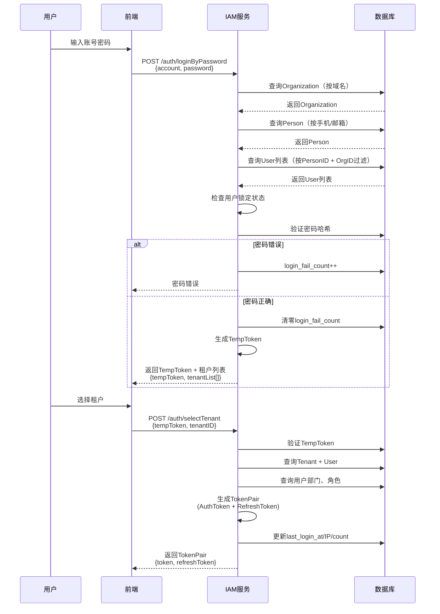

#### 3.2.2 登录流程（不含租户选择）

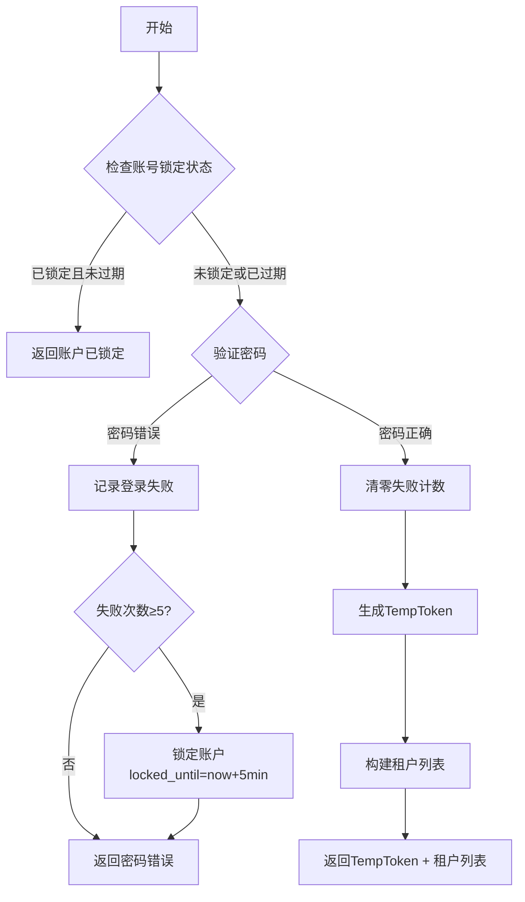

#### 3.2.3 API 接口

| 方法 | 路径 | 说明 | 认证 |
|------|------|------|------|
| POST | `/v1/iam/auth/loginByPassword` | 密码登录 | 否 |
| POST | `/v1/iam/auth/selectTenant` | 选择租户获取Token | TempToken |
| POST | `/v1/iam/auth/refreshToken` | 刷新Token | RefreshToken |
| POST | `/v1/iam/auth/logout` | 登出 | AuthToken |
| POST | `/v1/iam/auth/unlockAccount` | 自助解锁 | 否 |

### 3.3 OIDC/SSO 授权码流程

#### 3.3.1 业务概念

OIDC（OpenID Connect）基于 OAuth2 的身份认证协议，支持第三方应用通过授权码模式实现单点登录。

#### 3.3.2 时序图

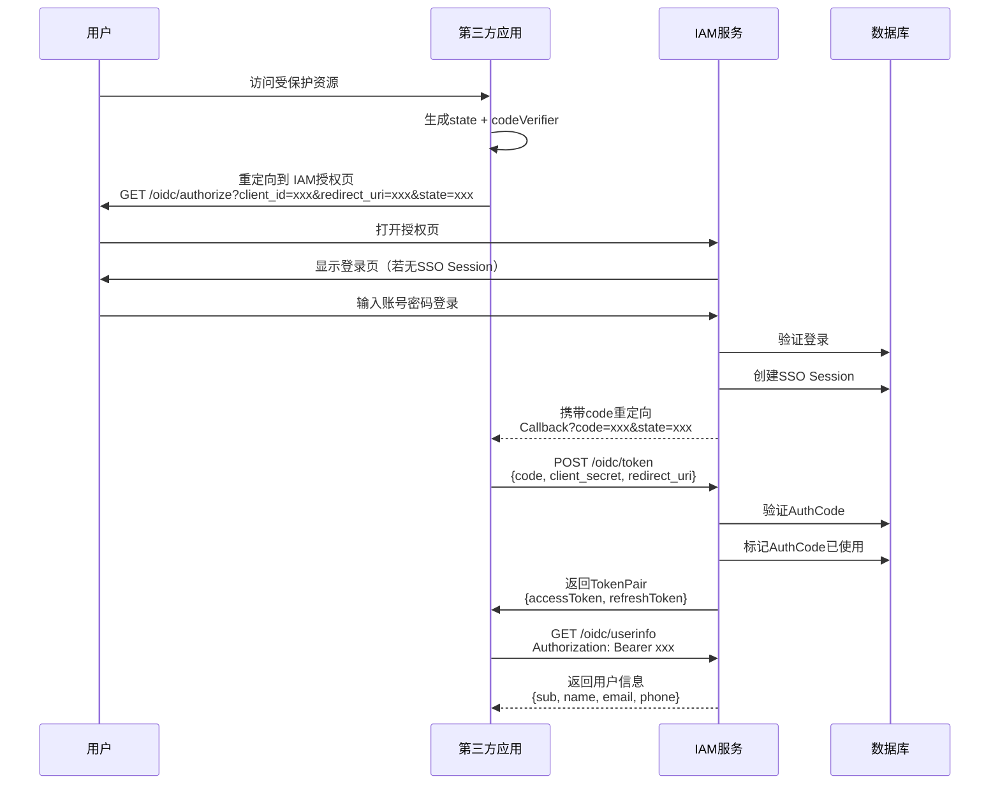

#### 3.3.3 授权页面流程

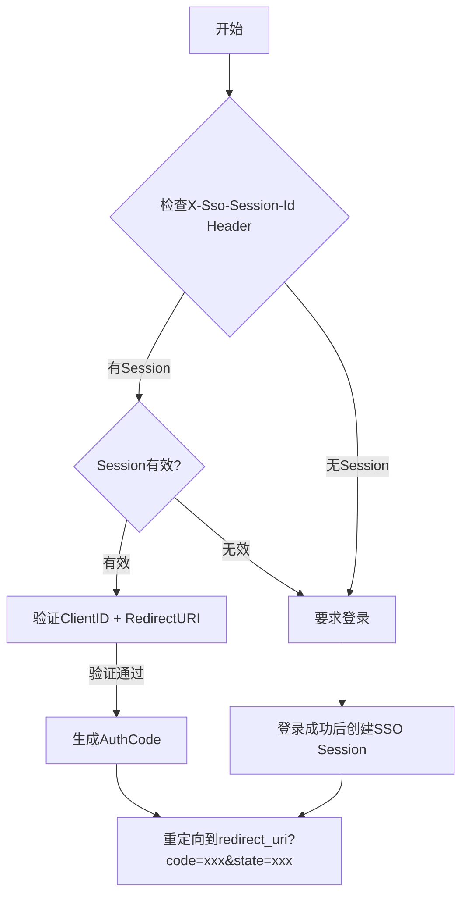

#### 3.3.4 Token 交换流程

```mermaid
flowchart TD
    A[开始] --> B{验证grant_type=authorization_code}
    B -->|否| C[返回不支持的grant_type]
    B -->|是| D{验证AuthCode}
    D -->|Code不存在/已使用/过期| E[返回无效Code]
    D -->|有效| F{验证RedirectURI]
    F -->|不匹配| G[返回URI不匹配]
    F -->|匹配| H{验证ClientSecret}
    H -->|不匹配| I[返回无效Client]
    H -->|匹配| J{检查PKCE}
    J -->|需要但未提供| K[返回PKCE Required]
    J -->|通过| L[标记AuthCode已使用]
    L --> M[生成AccessToken + RefreshToken]
    M --> N[返回TokenPair]
```

#### 3.3.5 API 接口

| 方法 | 路径 | 说明 | 认证 |
|------|------|------|------|
| GET | `/v1/iam/oidc/authorize` | 授权入口 | Session/登录 |
| POST | `/v1/iam/oidc/token` | 获取Token | ClientSecret |
| POST | `/v1/iam/oidc/refreshToken` | 刷新Token | RefreshToken |
| GET | `/v1/iam/oidc/userinfo` | 获取用户信息 | AccessToken |
| POST | `/v1/iam/oidc/logout` | OIDC登出 | AuthToken |

### 3.4 Token 管理

#### 3.4.1 Token 黑名单机制

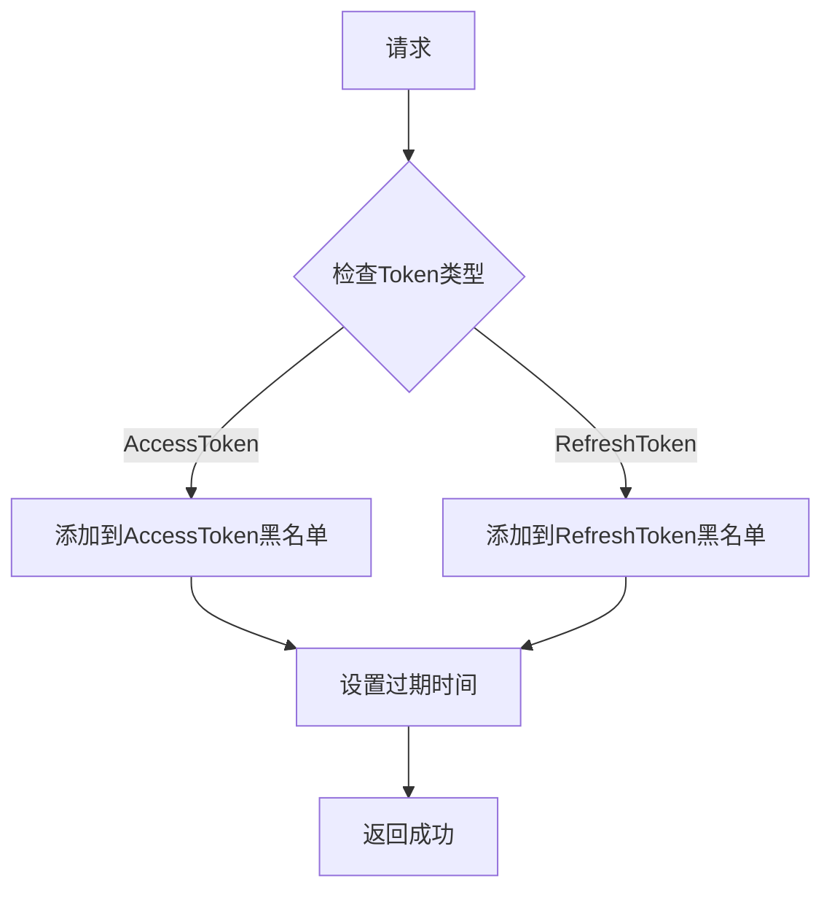

#### 3.4.2 Token 刷新流程

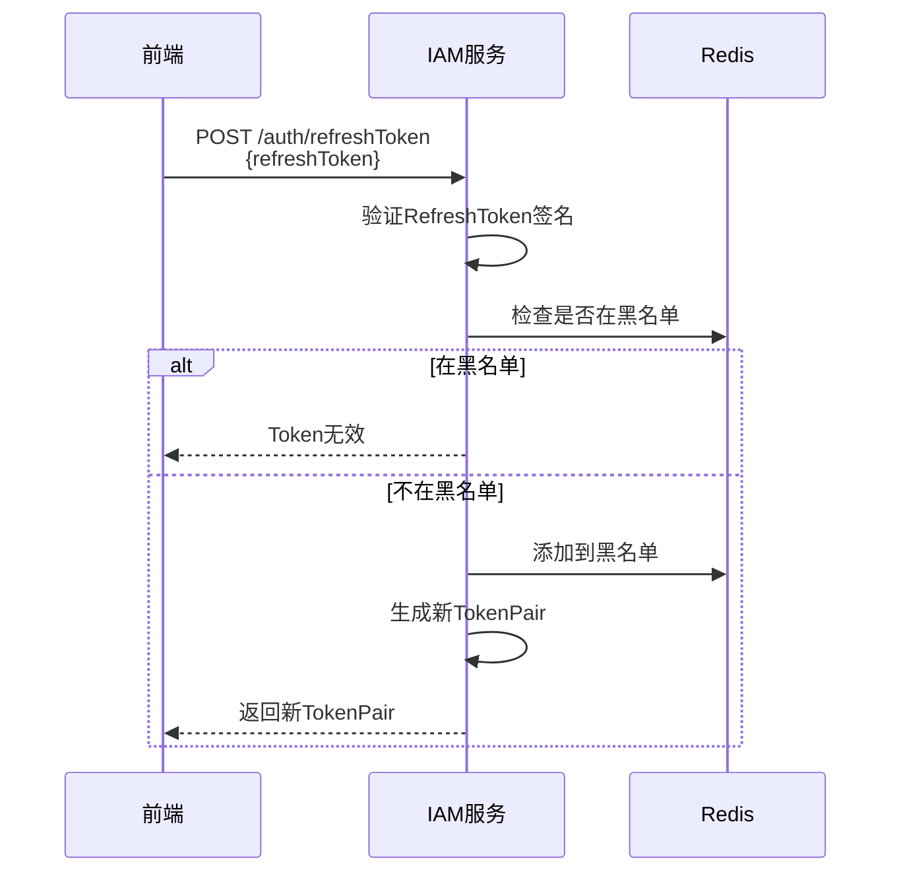

### 3.5 用户注册流程

#### 3.5.1 时序图

```mermaid
sequenceDiagram
    participant U as 用户
    participant C as 前端
    participant IAM as IAM服务
    participant DB as 数据库

    U->>C: 填写注册信息
    C->>IAM: POST /auth/register<br/>{username, password, email, mobile, tenantName, tenantCode}
    IAM->>DB: 查询Organization（按域名）
    IAM->>DB: 检查注册是否开放
    IAM->>DB: 验证身份类型（邮箱/手机/两者）
    alt 需要审核
        UserStatus = disabled
    else 直接启用
        UserStatus = enabled
    end
    IAM->>DB: 生成密码哈希
    IAM->>DB: 事务创建:
    Note over DB: 1. Tenant<br/>2. Department<br/>3. Person<br/>4. User<br/>5. UserDepartment
    IAM-->>C: 返回结果<br/>{tenantID, userID, status, message}
```

#### 3.5.2 API 接口

| 方法 | 路径 | 说明 | 认证 |
|------|------|------|------|
| POST | `/v1/iam/auth/register` | 用户注册 | 否 |

---

## 四、用户管理模块

### 4.1 业务概念

#### 4.1.1 用户类型
| 类型 | 说明 |
|------|------|
| normal | 普通用户 |
| tenant_admin | 租户管理员 |
| platform_admin | 平台管理员（可管理所有租户） |

#### 4.1.2 用户与部门关系
- 一个用户只能有一个主部门（primary）
- 一个用户可以有多个副部门（secondary）
- 关系存储在 `iam_user_department` 表

#### 4.1.3 用户与角色关系
- 用户角色分配为全量替换模式
- 关系存储在 `iam_user_role` 表

### 4.2 创建用户流程

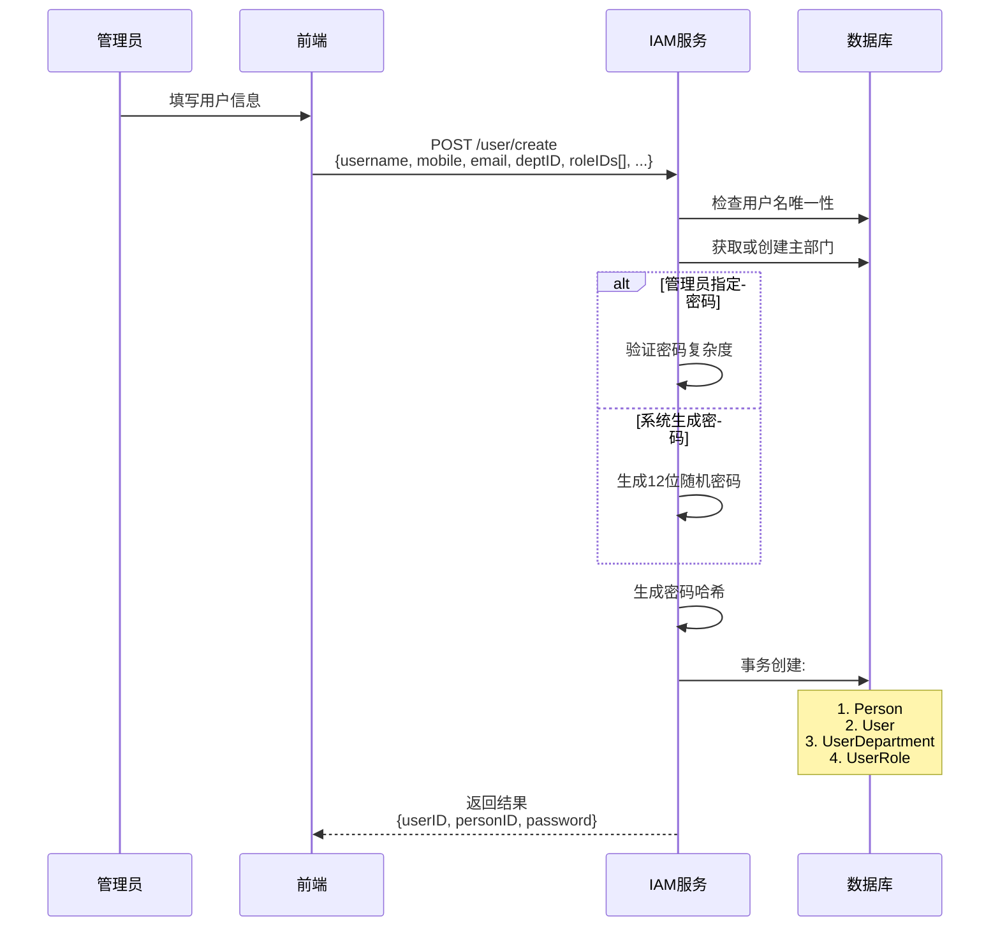

### 4.3 分配部门流程

```mermaid
flowchart TD
    A[开始] --> B{验证用户存在}
    B -->|不存在| C[返回用户不存在]
    B -->|存在| D{验证主部门存在且属于当前租户]
    D -->|不通过| E[返回部门不存在/范围错误]
    D -->|通过| F{验证副部门存在且属于当前租户]
    F -->|存在无效| G[返回部门不存在/范围错误]
    F -->|全部通过| H[开启事务]
    H --> I[删除现有部门关联]
    I --> J[插入主部门关联]
    J --> K[插入副部门关联]
    K --> L[提交事务]
    L --> M[更新用户主部门字段]
```

### 4.4 分配角色流程

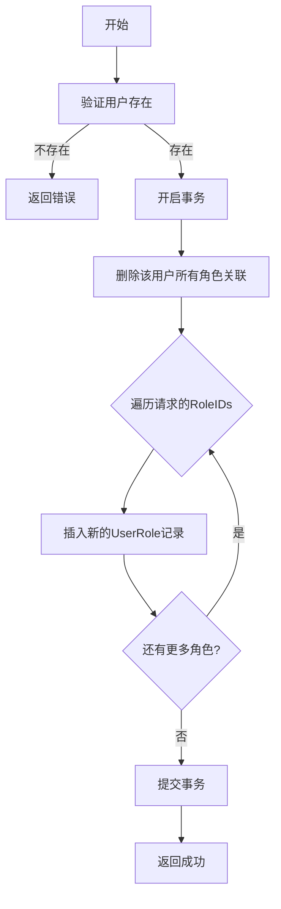

### 4.5 个人中心流程

#### 5.5.1 获取当前用户信息

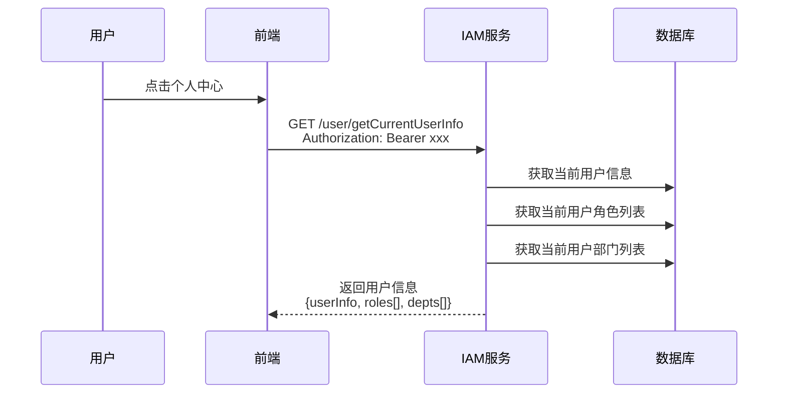

#### 5.5.2 修改密码

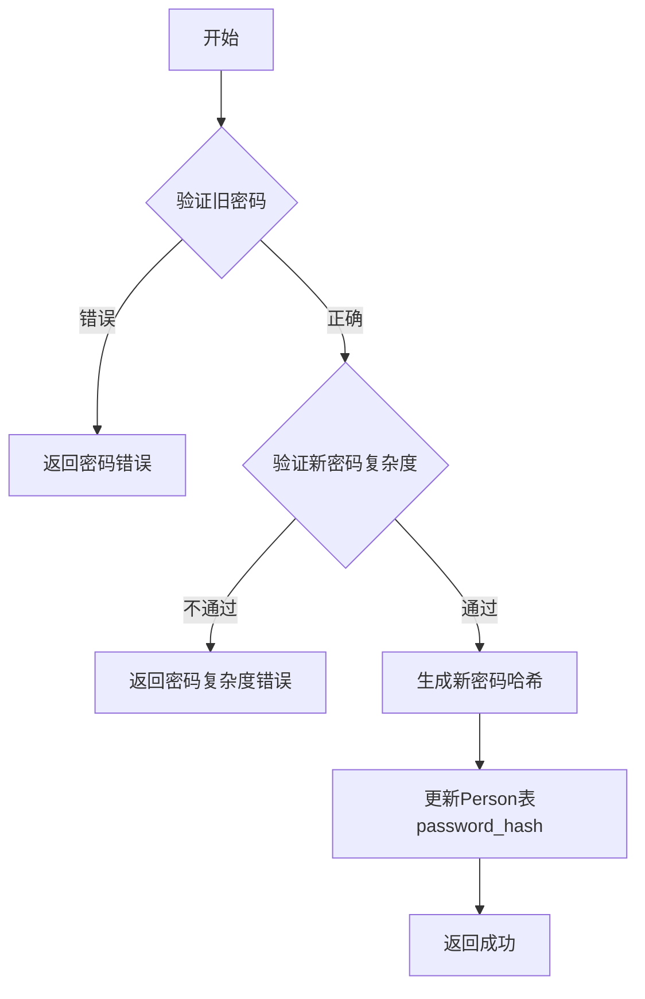

### 4.6 API 接口

| 方法 | 路径 | 说明 | 认证 |
|------|------|------|------|
| POST | `/v1/iam/user/create` | 创建用户 | AuthToken |
| POST | `/v1/iam/user/delete` | 删除用户 | AuthToken |
| POST | `/v1/iam/user/update` | 更新用户 | AuthToken |
| GET | `/v1/iam/user/detail` | 获取用户详情 | AuthToken |
| POST | `/v1/iam/user/pageList` | 分页查询用户 | AuthToken |
| POST | `/v1/iam/user/assignDepartments` | 分配部门 | AuthToken |
| GET | `/v1/iam/user/listDepartments` | 获取用户部门列表 | AuthToken |
| POST | `/v1/iam/user/assignRoles` | 分配角色 | AuthToken |
| GET | `/v1/iam/user/listRoles` | 获取用户角色列表 | AuthToken |
| GET | `/v1/iam/user/getCurrentUserInfo` | 获取当前用户信息 | AuthToken |
| POST | `/v1/iam/user/updateProfile` | 更新个人资料 | AuthToken |
| POST | `/v1/iam/user/changePassword` | 修改密码 | AuthToken |
| GET | `/v1/iam/user/loginHistory` | 登录历史 | AuthToken |
| POST | `/v1/iam/user/logout` | 登出 | AuthToken |

---

## 五、组织架构模块

### 5.1 业务概念

#### 5.1.1 层级关系

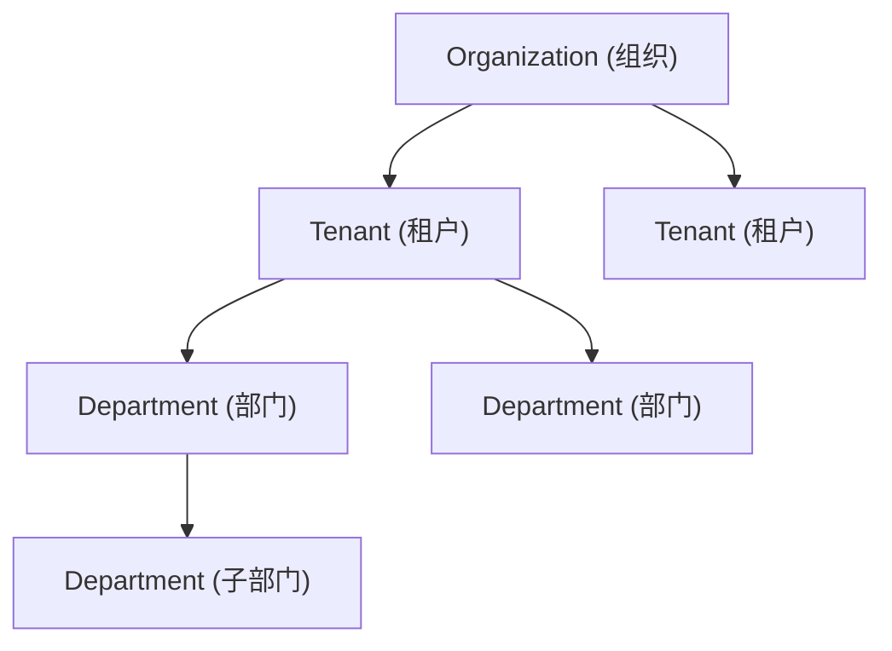

#### 5.1.2 租户路径（tenant_path）
- 格式：`/{parent_id}/{id}/`
- 示例：`/1/5/` 表示 ID 为 5 的租户，上级为 ID=1 的租户
- 用于支持多级租户和快速查询子租户

#### 5.1.3 部门路径（dept_path）
- 格式：`/{parent_id}/{id}/`
- 示例：`/1/3/7/` 表示 ID 为 7 的部门，路径为 根部门->3->7
- 用于支持多级部门和快速查询子部门

### 5.2 API 接口

#### Organization（组织管理）
| 方法 | 路径 | 说明 | 认证 |
|------|------|------|------|
| POST | `/v1/iam/organization/create` | 创建组织 | AuthToken |
| POST | `/v1/iam/organization/delete` | 删除组织 | AuthToken |
| POST | `/v1/iam/organization/update` | 更新组织 | AuthToken |
| GET | `/v1/iam/organization/detail` | 获取组织详情 | AuthToken |
| POST | `/v1/iam/organization/pageList` | 分页查询组织 | AuthToken |
| GET | `/v1/iam/organization/getOrgConfig` | 获取组织配置 | AuthToken |
| GET | `/v1/iam/organization/listConfigDefinitions` | 获取配置定义 | AuthToken |

#### Tenant（租户管理）
| 方法 | 路径 | 说明 | 认证 |
|------|------|------|------|
| POST | `/v1/iam/tenant/create` | 创建租户 | AuthToken |
| POST | `/v1/iam/tenant/delete` | 删除租户 | AuthToken |
| POST | `/v1/iam/tenant/update` | 更新租户 | AuthToken |
| GET | `/v1/iam/tenant/detail` | 获取租户详情 | AuthToken |
| POST | `/v1/iam/tenant/pageList` | 分页查询租户 | AuthToken |

#### Department（部门管理）
| 方法 | 路径 | 说明 | 认证 |
|------|------|------|------|
| POST | `/v1/iam/department/create` | 创建部门 | AuthToken |
| POST | `/v1/iam/department/delete` | 删除部门 | AuthToken |
| POST | `/v1/iam/department/update` | 更新部门 | AuthToken |
| GET | `/v1/iam/department/detail` | 获取部门详情 | AuthToken |
| POST | `/v1/iam/department/pageList` | 分页查询部门 | AuthToken |
| GET | `/v1/iam/department/tree` | 获取部门树 | AuthToken |

---

## 六、权限管理模块

### 6.1 业务概念

#### 6.1.1 角色类型
| 类型 | 说明 |
|------|------|
| custom | 自定义角色 |
| system | 系统内置角色 |

#### 6.1.2 数据权限范围
| 范围 | 说明 |
|------|------|
| all | 全部数据 |
| dept_and_sub | 本部门及所有子部门 |
| dept | 仅本部门 |
| self | 仅本人数据 |
| custom | 自定义数据权限 |

#### 6.1.3 菜单类型
| 类型 | 说明 |
|------|------|
| directory | 目录（不可点击） |
| menu | 菜单（可点击） |
| button | 按钮（权限点） |

#### 6.1.4 访问策略
| 策略 | 说明 |
|------|------|
| public | 所有人均可访问 |
| authorized | 需要登录 |
| org_admin | 组织管理员 |
| tenant_admin | 租户管理员 |

### 6.2 角色分配菜单流程

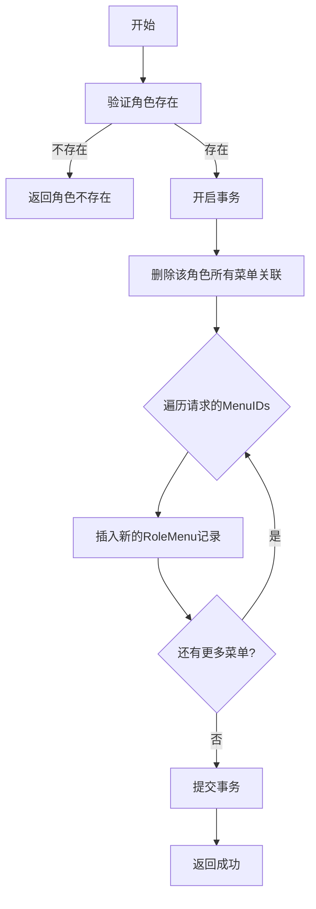

### 6.3 API 接口

#### Menu（菜单管理）
| 方法 | 路径 | 说明 | 认证 |
|------|------|------|------|
| POST | `/v1/iam/menu/create` | 创建菜单 | AuthToken |
| POST | `/v1/iam/menu/delete` | 删除菜单 | AuthToken |
| POST | `/v1/iam/menu/update` | 更新菜单 | AuthToken |
| GET | `/v1/iam/menu/detail` | 获取菜单详情 | AuthToken |
| POST | `/v1/iam/menu/pageList` | 分页查询菜单 | AuthToken |
| GET | `/v1/iam/menu/tree` | 获取菜单树 | AuthToken |

#### Role（角色管理）
| 方法 | 路径 | 说明 | 认证 |
|------|------|------|------|
| POST | `/v1/iam/role/create` | 创建角色 | AuthToken |
| POST | `/v1/iam/role/delete` | 删除角色 | AuthToken |
| POST | `/v1/iam/role/update` | 更新角色 | AuthToken |
| GET | `/v1/iam/role/detail` | 获取角色详情 | AuthToken |
| POST | `/v1/iam/role/pageList` | 分页查询角色 | AuthToken |
| POST | `/v1/iam/role/assignMenus` | 分配菜单 | AuthToken |
| GET | `/v1/iam/role/listMenus` | 获取角色菜单列表 | AuthToken |

---

## 七、应用与 API Key 模块

### 7.1 业务概念

#### 7.1.1 Application（应用）
- 用于配置 OIDC 客户端信息
- 支持 PKCE 可选启用
- 支持配置允许的重定向 URI

#### 7.1.2 API Key
- 用于服务端 API 调用身份认证
- 支持设置过期时间

### 7.2 API 接口

#### Application（应用管理）
| 方法 | 路径 | 说明 | 认证 |
|------|------|------|------|
| POST | `/v1/iam/application/create` | 创建应用 | AuthToken |
| POST | `/v1/iam/application/delete` | 删除应用 | AuthToken |
| POST | `/v1/iam/application/update` | 更新应用 | AuthToken |
| GET | `/v1/iam/application/detail` | 获取应用详情 | AuthToken |
| POST | `/v1/iam/application/pageList` | 分页查询应用 | AuthToken |

---

## 八、日志模块

### 8.1 API 接口

#### 登录日志
| 方法 | 路径 | 说明 | 认证 |
|------|------|------|------|
| POST | `/v1/iam/auth/loginLog/create` | 创建登录日志 | 否 |
| GET | `/v1/iam/auth/loginLog/pageList` | 分页查询登录日志 | AuthToken |

#### 操作日志
| 方法 | 路径 | 说明 | 认证 |
|------|------|------|------|
| POST | `/v1/iam/auth/operationLog/create` | 创建操作日志 | 否 |
| GET | `/v1/iam/auth/operationLog/pageList` | 分页查询操作日志 | AuthToken |

---

## 附录

### A. 错误码说明

| 错误码 | 说明 |
|--------|------|
| AuthLoginError | 登录失败 |
| AuthPasswordError | 密码错误 |
| AuthOrgNotFoundError | 组织不存在 |
| AuthPersonNotFoundError | 自然人不存在 |
| AuthNoTenantError | 没有可用的租户 |
| AuthTenantSelectError | 租户选择失败 |
| AuthRefreshTokenInvalidError | RefreshToken无效 |
| OIDCClientInvalidError | OIDC客户端无效 |
| OIDCInvalidCodeError | 授权码无效 |
| UserNotExistError | 用户不存在 |
| UsernameDuplicateError | 用户名重复 |
| DepartmentNotExistError | 部门不存在 |
| PasswordComplexityError | 密码复杂度不足 |

### B. 密码安全策略配置项

| 配置项 | 类型 | 默认值 | 说明 |
|--------|------|--------|------|
| password_min_length | int | 8 | 最小长度 |
| password_require_uppercase | bool | true | 必须包含大写字母 |
| password_require_lowercase | bool | true | 必须包含小写字母 |
| password_require_number | bool | true | 必须包含数字 |
| password_require_special | bool | false | 必须包含特殊字符 |
| login_max_fail_count | int | 5 | 登录失败最大次数 |
| login_lock_duration | int | 300 | 锁定时长/秒 |
