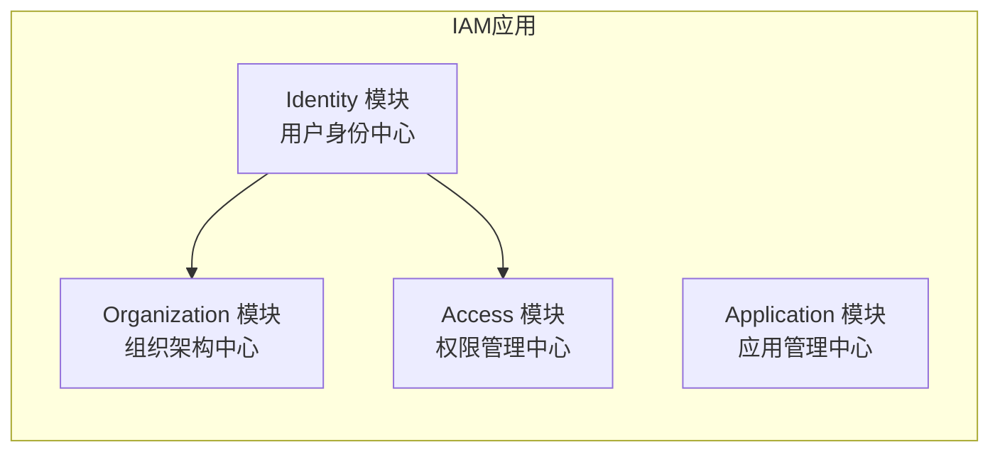
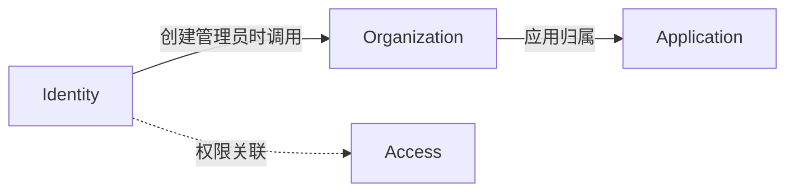

# IAM 模块拆分架构设计

## 1. 背景与目标

### 1.1 现状问题

当前 IAM 系统是典型的三层架构（Controller → Service → DAO）单体应用，存在以下问题：

| 问题 | 描述 |
|------|------|
| 模块耦合度高 | Service 层模块间直接依赖，如 `svcorg` 依赖 `core/user` |
| 代码边界模糊 | DAO 层所有表操作集中在同一包，职责不清晰 |
| 部署粒度粗 | 无法按业务需求独立部署和扩展 |
| 维护成本高 | 代码膨胀后，团队协作受限 |

### 1.2 拆分目标

- **代码维护性**：模块职责清晰，便于长期维护
- **团队自治**：模块间通过接口交互，减少跨团队协调
- **渐进演进**：为未来微服务化奠定基础
- **独立测试**：支持按模块独立测试和部署

---

## 2. 模块划分方案

### 2.1 设计原则

| 原则 | 说明 |
|------|------|
| 领域驱动 | 按业务领域（Domain）划分，而非按技术层级 |
| 职责内聚 | 相关业务高度内聚，减少跨模块调用 |
| 接口解耦 | 模块间通过接口交互，禁止直接引用实现 |
| 共享数据库 | 初期保持单数据库，按表前缀逻辑隔离 |

### 2.2 模块划分

按业务领域合并为 **4 个核心模块**：



| 模块 | 包含原模块 | 英文名 | 职责 |
|------|-----------|--------|------|
| **Identity** | User + Auth | identity | 用户身份、登录认证、密码管理 |
| **Organization** | Org + Dept + Tenant | organization | 组织架构、部门层级、租户管理 |
| **Access** | Role + Menu | access | 角色权限、菜单分配、权限控制 |
| **Application** | App | application | 第三方应用接入 |

### 2.3 目录结构

```
apps/iam/
├── cmd/                      # 程序入口
├── config/                   # 配置
├── internal/
│   ├── identity/             # Identity 模块
│   │   ├── controller/       # 控制器（用户、认证）
│   │   ├── service/         # 服务实现
│   │   ├── dto/             # 数据传输对象
│   │   └── interface.go     # 对外接口定义
│   ├── organization/        # Organization 模块
│   │   ├── controller/      # 控制器（组织、部门、租户）
│   │   ├── service/        # 服务实现
│   │   ├── dto/
│   │   └── interface.go
│   ├── access/              # Access 模块
│   │   ├── controller/      # 控制器（角色、菜单）
│   │   ├── service/        # 服务实现
│   │   ├── dto/
│   │   └── interface.go
│   └── application/         # Application 模块
│       ├── controller/
│       ├── service/
│       ├── dto/
│       └── interface.go
├── dao/                     # 数据访问层
│   ├── base/                # 基础 DAO 抽象
│   ├── user.go
│   ├── person.go
│   ├── department.go
│   ├── role.go
│   ├── menu.go
│   ├── application.go
│   ├── organization.go
│   ├── tenant.go
│   └── relation/            # 关系表 DAO
│       ├── user_department.go
│       ├── user_role.go
│       ├── role_menu.go
│       └── organization_application.go
├── model/                   # 数据模型层
│   ├── entity/              # 实体定义
│   ├── relation/            # 关系实体
│   └── const.go             # 枚举和常量定义
└── router/                  # 路由注册
    ├── router.go
    ├── identity.go
    ├── organization.go
    ├── access.go
    └── application.go
```

---

## 3. 模块职责与接口

### 3.1 Identity 模块

**职责**：用户身份管理、登录认证、密码管理

**接口**：

```go
type IdentitySvc interface {
    // 认证
    Login(ctx *gin.Context, req *dto.LoginReq) (*dto.LoginResp, error)
    Register(ctx *gin.Context, req *dto.RegisterReq) (*dto.RegisterResp, error)
    Logout(ctx *gin.Context) error
    RefreshToken(ctx *gin.Context, req *dto.RefreshTokenReq) (*dto.RefreshTokenResp, error)

    // 用户
    CreateUser(ctx *gin.Context, req *dto.UserCreateReq) (*dto.UserCreateResp, error)
    UpdateUser(ctx *gin.Context, req *dto.UserUpdateReq) error
    DeleteUser(ctx *gin.Context, req *dto.UserDeleteReq) error
    GetUserDetail(ctx *gin.Context, req *dto.UserDetailReq) (*dto.UserDetailResp, error)
    ListUsers(ctx *gin.Context, req *dto.UserPageListReq) (*dto.UserPageListResp, error)
    AssignDept(ctx *gin.Context, req *dto.UserAssignDeptReq) error
    AssignRole(ctx *gin.Context, req *dto.UserAssignRoleReq) error
    UpdatePassword(ctx *gin.Context, req *dto.UpdatePasswordReq) error
}
```

**依赖**：无

### 3.2 Organization 模块

**职责**：组织架构管理、部门层级、租户管理

**接口**：

```go
type OrganizationSvc interface {
    // 组织
    CreateOrg(ctx *gin.Context, req *dto.OrgCreateReq) (*dto.OrgCreateResp, error)
    UpdateOrg(ctx *gin.Context, req *dto.OrgUpdateReq) error
    DeleteOrg(ctx *gin.Context, req *dto.OrgDeleteReq) error
    GetOrgDetail(ctx *gin.Context, req *dto.OrgDetailReq) (*dto.OrgDetailResp, error)
    ListOrgs(ctx *gin.Context, req *dto.OrgPageListReq) (*dto.OrgPageListResp, error)
    UpdateOrgConfig(ctx *gin.Context, req *dto.OrgUpdateConfigReq) error

    // 部门
    CreateDept(ctx *gin.Context, req *dto.DeptCreateReq) (*dto.DeptCreateResp, error)
    UpdateDept(ctx *gin.Context, req *dto.DeptUpdateReq) error
    DeleteDept(ctx *gin.Context, req *dto.DeptDeleteReq) error
    GetDeptDetail(ctx *gin.Context, req *dto.DeptDetailReq) (*dto.DeptDetailResp, error)
    GetDeptTree(ctx *gin.Context, req *dto.DeptTreeReq) (*dto.DeptTreeResp, error)

    // 租户
    CreateTenant(ctx *gin.Context, req *dto.TenantCreateReq) (*dto.TenantCreateResp, error)
    UpdateTenant(ctx *gin.Context, req *dto.TenantUpdateReq) error
    DeleteTenant(ctx *gin.Context, req *dto.TenantDeleteReq) error
    GetTenantDetail(ctx *gin.Context, req *dto.TenantDetailReq) (*dto.TenantDetailResp, error)
    ListTenants(ctx *gin.Context, req *dto.TenantPageListReq) (*dto.TenantPageListResp, error)
}
```

**依赖**：Identity（创建组织管理员时调用）

### 3.3 Access 模块

**职责**：角色权限管理、菜单分配、权限控制

**接口**：

```go
type AccessSvc interface {
    // 角色
    CreateRole(ctx *gin.Context, req *dto.RoleCreateReq) (*dto.RoleCreateResp, error)
    UpdateRole(ctx *gin.Context, req *dto.RoleUpdateReq) error
    DeleteRole(ctx *gin.Context, req *dto.RoleDeleteReq) error
    GetRoleDetail(ctx *gin.Context, req *dto.RoleDetailReq) (*dto.RoleDetailResp, error)
    ListRoles(ctx *gin.Context, req *dto.RolePageListReq) (*dto.RolePageListResp, error)

    // 菜单
    CreateMenu(ctx *gin.Context, req *dto.MenuCreateReq) (*dto.MenuCreateResp, error)
    UpdateMenu(ctx *gin.Context, req *dto.MenuUpdateReq) error
    DeleteMenu(ctx *gin.Context, req *dto.MenuDeleteReq) error
    GetMenuDetail(ctx *gin.Context, req *dto.MenuDetailReq) (*dto.MenuDetailResp, error)
    GetMenuTree(ctx *gin.Context, req *dto.MenuTreeReq) (*dto.MenuTreeResp, error)
    AssignPermissions(ctx *gin.Context, req *dto.AssignPermissionsReq) error
}
```

**依赖**：无（纯内聚模块）

### 3.4 Application 模块

**职责**：第三方应用接入、应用配置

**接口**：

```go
type ApplicationSvc interface {
    CreateApp(ctx *gin.Context, req *dto.AppCreateReq) (*dto.AppCreateResp, error)
    UpdateApp(ctx *gin.Context, req *dto.AppUpdateReq) error
    DeleteApp(ctx *gin.Context, req *dto.AppDeleteReq) error
    GetAppDetail(ctx *gin.Context, req *dto.AppDetailReq) (*dto.AppDetailResp, error)
    ListApps(ctx *gin.Context, req *dto.AppPageListReq) (*dto.AppPageListResp, error)
}
```

**依赖**：Organization（应用归属组织）

---

## 4. 路由结构

```
/v1/iam
├── /identity
│   ├── POST /login
│   ├── POST /register
│   ├── POST /logout
│   ├── POST /refresh
│   ├── POST /create          # 创建用户
│   ├── POST /update          # 更新用户
│   ├── POST /delete          # 删除用户
│   ├── GET /detail           # 用户详情
│   ├── GET /pageList         # 用户列表
│   ├── POST /assignDept      # 分配部门
│   ├── POST /assignRole      # 分配角色
│   └── POST /updatePassword  # 修改密码
│
├── /organization
│   ├── /org
│   │   ├── POST /create
│   │   ├── POST /update
│   │   ├── POST /delete
│   │   ├── GET /detail
│   │   ├── GET /pageList
│   │   └── POST /updateConfig
│   ├── /dept
│   │   ├── POST /create
│   │   ├── POST /update
│   │   ├── POST /delete
│   │   ├── GET /detail
│   │   └── GET /tree
│   └── /tenant
│       ├── POST /create
│       ├── POST /update
│       ├── POST /delete
│       ├── GET /detail
│       └── GET /pageList
│
├── /access
│   ├── /role
│   │   ├── POST /create
│   │   ├── POST /update
│   │   ├── POST /delete
│   │   ├── GET /detail
│   │   └── GET /pageList
│   └── /menu
│       ├── POST /create
│       ├── POST /update
│       ├── POST /delete
│       ├── GET /detail
│       ├── GET /tree
│       └── POST /assignPermissions
│
└── /application
    ├── POST /create
    ├── POST /update
    ├── POST /delete
    ├── GET /detail
    └── GET /pageList
```

---

## 5. 模块依赖关系

### 5.1 依赖矩阵

| 消费者 → 提供者 | Identity | Organization | Access | Application |
|----------------|----------|--------------|--------|-------------|
| **Identity** | - | ✗ | ✗ | ✗ |
| **Organization** | ✓ | - | ✗ | ✗ |
| **Access** | ✗ | ✗ | - | ✗ |
| **Application** | ✗ | ✓ | ✗ | - |

**说明**：
- ✓ 表示依赖该模块
- ✗ 表示不依赖该模块
- **Identity**：不依赖其他模块（基础认证服务）
- **Organization**：依赖 Identity（创建组织管理员时调用）
- **Access**：纯内聚模块，不依赖其他模块
- **Application**：依赖 Organization（应用归属组织）

### 5.2 依赖关系图



---

## 6. 数据模型

### 6.1 表前缀约定

为后续可能的分库做准备，按模块约定表前缀：

| 模块 | 表前缀 | 示例 |
|------|--------|------|
| Identity | `iam_` | `iam_user`, `iam_person` |
| Organization | `iam_org_` | `iam_org_organization`, `iam_org_department`, `iam_org_tenant` |
| Access | `iam_access_` | `iam_access_role`, `iam_access_menu` |
| Application | `iam_app_` | `iam_app_application` |
| 关系表 | `iam_rel_` | `iam_rel_user_role`, `iam_rel_role_menu` |

### 6.2 关系表归属

| 关系表 | 归属模块 |
|--------|----------|
| `iam_rel_user_department` | Organization |
| `iam_rel_user_role` | Organization |
| `iam_rel_role_menu` | Access |
| `iam_rel_org_app` | Organization |
| `iam_rel_tenant_app` | Organization |

---

## 7. 实施计划

### 7.1 实施原则

1. **不破坏现有功能**：重构过程中确保现有 API 行为不变
2. **小步快跑**：每次只重构一个模块，完成后验证
3. **接口先行**：先定义接口，再实现重构
4. **保持兼容**：通过适配器模式保持新旧代码共存

### 7.2 实施阶段

#### 阶段一：基础设施准备（3-5天）

| 任务 | 说明 | 产出 |
|------|------|------|
| 创建包结构 | 按目标目录结构创建空包 | 目录骨架 |
| 定义基础 DAO | 在 `dao/base/` 中定义基础接口 | `IBaseDAO` |
| 整理常量 | 统一枚举到 `model/const.go` | 常量定义文件 |
| 整理关系表 DAO | 抽取关系表 DAO 到 `dao/relation/` | Relation DAO |

#### 阶段二：模块重构（2-3周）

| 顺序 | 模块 | 任务 | 验证 |
|------|------|------|------|
| 1 | Access | Role + Menu 合并重构 | API 测试 |
| 2 | Organization | Org + Dept + Tenant 合并重构 | API 测试 |
| 3 | Identity | User + Auth 合并重构 | API 测试 |
| 4 | Application | App 重构 | API 测试 |

**每个模块重构步骤**：

1. 在新目录创建 `interface.go` 定义接口
2. 将原 service 代码迁移到新目录
3. 将原 dto 代码迁移到新目录
4. 将原 controller 代码迁移到新目录
5. 创建接口适配器连接新旧代码
6. 更新路由注册
7. 运行测试验证

#### 阶段三：清理（3-5天）

| 任务 | 说明 |
|------|------|
| 删除旧代码 | 移除原 `internal/service/`、`internal/controller/` 等目录 |
| 整理 imports | 更新所有 import 路径 |
| 更新路由注册 | 统一使用新模块路径注册路由 |
| 全量测试 | 运行完整测试套件 |

### 7.3 时间估算

| 阶段 | 工期 | 累计 |
|------|------|------|
| 阶段一 | 3-5 天 | 1 周 |
| 阶段二 | 2-3 周 | 3-4 周 |
| 阶段三 | 3-5 天 | 4 周 |

---

## 8. 风险与应对

| 风险 | 等级 | 应对措施 |
|------|------|----------|
| 重构过程中业务中断 | 高 | 使用适配器模式，新旧代码共存，逐步切换 |
| 循环依赖 | 高 | 严格遵守依赖矩阵，禁止逆向依赖 |
| 接口变更影响范围大 | 中 | 接口设计评审，版本化管理 |
| 测试覆盖不足 | 中 | 要求每个模块单元测试覆盖率 > 70% |

---

## 9. 架构评审检查清单

### 模块划分
- [ ] 模块职责边界是否清晰
- [ ] 模块依赖关系是否正确（无循环依赖）
- [ ] 模块是否满足高内聚低耦合

### 接口设计
- [ ] 接口定义是否合理
- [ ] 接口是否稳定（避免频繁变更）
- [ ] 接口文档是否完善

### 可维护性
- [ ] 代码结构是否清晰
- [ ] 是否有统一的错误处理
- [ ] 是否符合 Go 代码规范

### 可测试性
- [ ] 模块是否可通过接口隔离测试
- [ ] 是否有单元测试
- [ ] 是否有集成测试

### 风险控制
- [ ] 是否有回滚方案
- [ ] 重构过程是否平滑
- [ ] 是否有灰度发布策略
